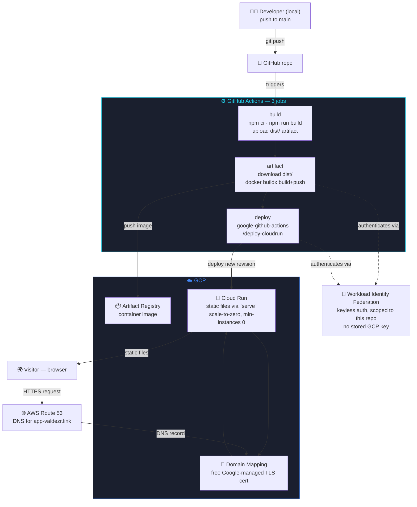

# dv-portfolio-website

Personal portfolio site — built with [Astro](https://astro.build), deployed
on Google Cloud Run, DNS on AWS Route 53. This repo has two purposes, not
one: it's the portfolio itself, and it's also a working demonstration of
an agentic Claude Code workflow — real hooks that caught and blocked
actual mistakes during development, real skills and reviewer/writer
agents used to build and maintain the infrastructure, not just checked-in
as unused scaffolding. See `.claude/`, adapted from
[claude-code-project-template](https://github.com/Dvzr2k/claude-code-project-template).

**Live at [app-valdezr.link](https://app-valdezr.link)** — English at `/`,
Spanish at `/es`.

## Architecture

Solid arrows are the live request path. Dashed arrows are build/deploy-time
relationships (CI push, auth) — not something a visitor's request ever
travels through.

## Why static, not server-rendered

Astro's default **static output** — every route is pre-built into a real
HTML file at build time (`dist/about/index.html`, `dist/es/index.html`,
etc.), served by a small static file server (`serve`) inside the container.
There's no Node/SSR adapter and no per-request rendering — a page load is
just Cloud Run handing back a file that already existed at build time.

## Why Cloud Run specifically

Cheaper/simpler static-hosting options existed (Firebase Hosting, Cloud
Storage + CDN, Netlify). Cloud Run was chosen deliberately over those,
since the goal is a DevOps-flavored portfolio (a real container, IaC, a
real CI/CD pipeline) rather than the absolute simplest way to host static
files.

## Why no Load Balancer

A GCP HTTPS Load Balancer bills a flat hourly rate for the forwarding rule
regardless of traffic (~$18-25/mo minimum). At this site's expected
traffic, that would be by far the biggest cost in the whole stack for no
real benefit. Cloud Run's own domain mapping gives a custom domain and a
free managed TLS cert without needing an LB at all.

## Continuous deployment

Every push to `main` runs three separate jobs:

1. **build** — installs dependencies, runs `npm run build`, uploads the
   static `dist/` output as a workflow artifact.
2. **artifact** — downloads that artifact, authenticates to GCP via
   Workload Identity Federation (no stored key), builds the container with
   Docker Buildx (GitHub Actions-native layer caching), and pushes it to
   Artifact Registry.
3. **deploy** — authenticates again via WIF, deploys the pushed image to
   Cloud Run via `google-github-actions/deploy-cloudrun`.

`PROJECT_ID`/`REGION` and the WIF provider/service-account live as GitHub
repo variables, not hardcoded in the workflow YAML — see
`.github/workflows/deploy.yml`.

## Infrastructure as code

Everything in `terraform/` — the Cloud Run service, Artifact Registry
repo, Workload Identity Federation pool/provider, the deploy service
account and its IAM bindings, and the domain mapping — is provisioned by
Terraform, not created by hand through the GCP console. State lives
remotely in a versioned GCS bucket.

## Agentic Claude Code workflow

The `.claude/` directory isn't boilerplate left over from the template —
every hook, skill, and agent below has actually run against this repo, not
just been checked in unused.

### Skills

| Skill | Real command | Used for |
|---|---|---|
| `/plan` | `terraform plan -out plan.out` | Preview infra changes before they touch anything |
| `/apply` | `terraform apply plan.out` | Apply a saved, reviewed plan — never `-auto-approve` |
| `/deploy` | push to `main`, then verify actual page *content* on the live site, not just that CI exited 0 | Ship a change and confirm it's really live |
| `/rollback` | `gcloud run services update-traffic --to-revisions=<prev>=100` | Shift traffic back to the last-known-good Cloud Run revision |
| `/audit` | runs the four review agents below in parallel | One combined security/cost/quality/docs pass |

### Agents

| Agent | Caught, concretely |
|---|---|
| `docs-reviewer` | Found this README describing an app that "hasn't been built yet" — weeks after it was actually built, deployed, and live. Full rewrite followed. |
| `tf-writer` | Generated the Cloud Run / Artifact Registry / Workload Identity Federation Terraform — GCP-specific, not the AWS defaults the template shipped with |
| `security-reviewer` | Scoped to this stack — knows the public Cloud Run invoker is an intentional exception here, not a finding to re-raise every run |
| `cost-reviewer` | Documents why there's no Load Balancer (~$18-25/mo minimum for zero benefit at this traffic) so that decision doesn't get silently re-flagged as a miss |
| `drift-detector` | Runs `terraform plan -detailed-exitcode` against the real GCP project to catch anything changed by hand outside Terraform |
| `quality-reviewer` | General reuse/simplification/dead-code review |

### Hooks — real incidents, not hypotheticals

- **`block-secret-commit.sh`** blocked `git add -A` outright, forcing
  explicit file-by-file staging throughout this project. It also had a
  genuine bug — its regex matched *any* filename starting with a dot
  (`git add .gitignore`) as if it were a bulk `git add .`, blocking normal,
  safe commits. Found, fixed, and tested here — then backported to
  [claude-code-project-template](https://github.com/Dvzr2k/claude-code-project-template)
  itself, so every future project scaffolded from it starts without the bug.
- **`warn-risky-action.sh`** enforces plan-before-apply on every
  `terraform apply` invocation across this project's setup — no exceptions taken.

## Tech stack

| Layer | Technology |
|---|---|
| Framework | Astro — static output |
| Hosting | Google Cloud Run |
| Image registry | Google Artifact Registry |
| DNS | AWS Route 53 (`app-valdezr.link`) |
| CI/CD | GitHub Actions — build / artifact / deploy |
| Deploy auth | Workload Identity Federation (keyless) |
| IaC | Terraform |
| Dev workflow | Claude Code — hooks, reviewer/writer agents, skills (see `.claude/`) |
