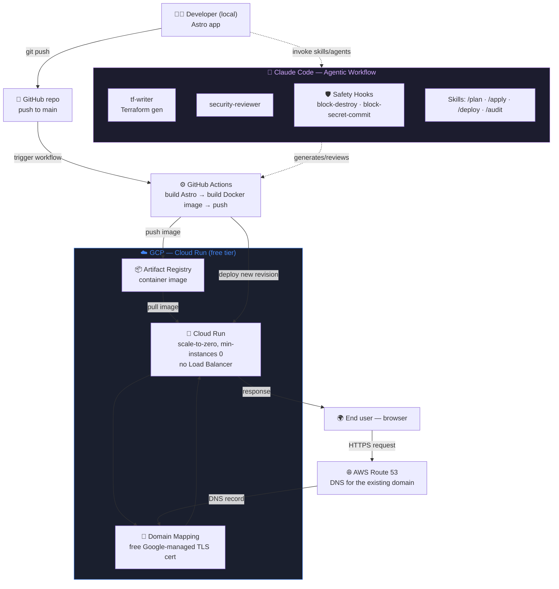

# dv-portfolio-website

Personal portfolio site — built with [Astro](https://astro.build), deployed
on Google Cloud Run, DNS on AWS Route 53. Built with an agentic Claude Code
workflow (see `.claude/`, adapted from
[claude-code-project-template](https://github.com/Dvzr2k/claude-code-project-template)).

> **Status: architecture only, nothing built yet.** The app itself
> (Phase 1) comes first; the infra below (Phase 2 — Dockerfile, Terraform,
> pipeline) gets built once the app is done. This diagram is the target
> shape, not the current state.

## Architecture (planned)

Solid arrows are the live request path. Dashed arrows are build/deploy-time
relationships (CI push, agent-assisted infra generation) — not something a
visitor's request ever travels through.

## Why no Load Balancer / no Cloud Storage

- **No Load Balancer** — a GCP HTTPS Load Balancer bills a flat hourly rate
  for the forwarding rule regardless of traffic (~$18-25/mo minimum). At
  the expected traffic for this site (~20 visitors/month), that would be
  by far the biggest cost in the whole stack for no real benefit. Cloud
  Run's default URL already serves HTTPS, and **domain mapping** gives a
  custom domain + free managed cert without needing an LB at all.
- **No Cloud Storage** — this isn't a static-file deployment; Cloud Run
  runs the Astro app's Node server directly inside a container, so there's
  no separate bucket serving assets.

## Why Cloud Run specifically

Cheaper/simpler options existed (Firebase Hosting, Cloud Storage + CDN) —
Cloud Run was chosen deliberately over those, since the goal is a
DevOps-flavored portfolio (containers, IaC, a real CI/CD pipeline) rather
than the absolute cheapest static hosting.

## Tech stack

| Layer | Technology |
|---|---|
| Framework | Astro (Node adapter — server output, not static) |
| Hosting | Google Cloud Run |
| Image registry | Google Artifact Registry |
| DNS | AWS Route 53 (existing domain) |
| CI/CD | GitHub Actions |
| IaC | Terraform |
| Dev workflow | Claude Code — hooks, reviewer agents, skills (see `.claude/`) |
